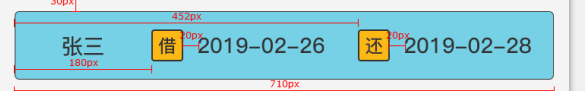
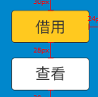

## router

登录页 '/login'

首页 '/home'

个人中心页 '/me'

物品领取记录 '/me/record/goods'

图书借取记录 '/me/record/books'

雨伞借取记录 '/me/record/umbrella'

我的资产 '/me/assets'

物品领取 '/goods'

共享图书 '/book'

图书详情 '/book/detail'

共享雨伞 '/umbrella'

## component

搜索框 'search-box'

可滑动 tabs 'tabs'

可滑动内容组件 'swiper'

借阅记录item 'BorrowRecordItem'

## scss

### mixin

rect-btn($bg-color, $color)

circle-btn($bg-color, $color)

### variable

$master-deep-orange: rgb(252,184,20) // 深橙

$master-light-orange: rgb(255,201,31) // 浅橙

$assist-deep-blue: rgb(0,135,204) // 深蓝

$assist-light-blue: rgb(118,209,230) // 浅蓝

$assist-grey: rgb(51,51,51) // 背景灰

## animation

购物小球贝塞尔曲线

